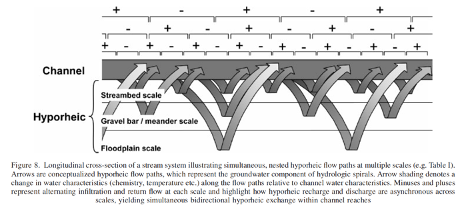

# Gateway Natural Area - Poudre River 
Stream-Groundwater Measurements Lab
Link: https://tpcovino.github.io/WR696/hydrology/Groundwater/Groundwater.html

In this lab, you will gain familiarity and experience in: (1) creating sketch maps; (2) measuring groundwater (GW) levels and stream stage; (3) creating GW contour maps, determining the direction of GW flow, using Darcy’s Law, and assessing whether the stream reach is gaining or losing; (4) measuring streamflow; (5) quantifying channel water balance; and (6) integrating, analyzing, and presenting data. When collecting and reviewing your data, think about the quality of the data in terms of its accuracy, precision, completeness, representativeness, and comparability. In your lab write-up you will be asked about the quality and usefulness of your data.

## Gateway Natural Area Background

“In 1903, the City of Fort Collins opened a water treatment facility at the confluence of the Cache La Poudre River and its North Fork tributary. Through the years, a small park developed. Depression-era Civilian Conservation Corps helped build several trails and roads here and in the surrounding areas. Visitors to Gateway Natural Area and the Poudre Canyon can still see signs of their skills. Gateway was closed to the public in the late 1970’s due to safety concerns. The water treatment facility was closed in the late 1980’s due to limited pipeline capacity and increasing water needs. In the summer of 2002, the City of Fort Collins once again opened the area to the public as Gateway Mountain Park. In late 2006, the City’s Natural Areas Program took over management and re-named it Gateway Natural Area.”

*Source: http://www.fcmod.org/trails/tour1/gateway-brochure.pdf

## Scientific Background

<iframe width="560" height="315" src="https://www.youtube.com/embed/83qBb7KRkAE" title="YouTube video player" frameborder="0" allow="accelerometer; autoplay; clipboard-write; encrypted-media; gyroscope; picture-in-picture" allowfullscreen="" data-external="1"></iframe>

There is a bidirectional exchange of water between streams and GW. Sometimes water is moving from the stream to the GW and other times the opposite is true. As with many things in hydrology this is both spatially and temporally variable. These interactions are spatially variable as a function of watershed morphology and geology – predominantly valley confinement and slope. They are temporally variable as a function of wetness and the interaction between river and GW stage. When GW stage is higher than river stage water will move from the GW to the stream and vice versa. Also while we characterize reaches as gaining or losing (meaning gaining water from or losing water to the GW), we recognize that they can simultaneously do both. This is in large part due to nesting of flowpaths. The figure from Poole et al. (2008) demonstrates this concept well.  

 

Due to the complexity of GW flow and stream-GW interactions, we often use multiple approaches to constrain GW problems. These include hydrometric, geochemical, and tracer approaches from field perspectives and modeling techniques from computational perspectives. Due to the inherent variability and lack of data in GW studies, multiple approaches help to constrain the possibilities and increase our confidence in conclusions. In this lab we will be using hydrometric approaches to quantify stream-GW interactions. If this were a longer project we would likely combine hydrometric and other approaches (e.g., geochemical and tracer). 

Hydrometric methods include things like wells, piezometers, and stream gauges. Essentially, we measure the heights (stage) of water in different places (both in GW and the river) and create maps of water height from these measurements. From these “topo” maps of water height we can then determine the direction of water flow and whether the river is gaining or losing. 

*We will NOT be using tracers in this lab. This is just for your information. 

With tracer methods we inject a tracer either into the river or GW well and measure its movement. In later labs we will be injecting tracers into the river. Because water movement through the subsurface (GW flow) is slow, tracer injections into GW wells take much longer. For instance, tracer injections in rivers may take hours for the entire tracer to move through, whereas in GW systems this may take months. 

In general tracer tests work in this way. We inject a known amount of tracer at a given location and measure the arrival of that tracer at a downstream (or downgradient in GW systems) location. The change in tracer concentration vs. time is referred to as the breakthrough curve (BTC). From the BTC we can calculate many properties of flow including: discharge, velocity, and stream-GW exchange.  

Geochemical methods: With geochemical methods we use the differences in geochemistry to determine stream-GW interaction. GW tends to have much higher concentrations of geochemical constituents such as Ca, Mg, and Si relative to stream water. We can use these different geochemical “signatures” to evaluate stream-GW mixing, quantify GW contributions to streamflow, and determine locations of GW inflow to the channel network. Why would GW have higher concentrations of things like Ca, Mg, and Si relative to stream water? What prediction might you make in terms of specific conductivity?  

## Assessment 
Complete the following assignment to prepare for using real-world groundwater data.

  + [Groundwater assessment](https://www.dropbox.com/s/macj8x8ufxyxo9k/Groundwater.docx?dl=0)

## Specific tasks – to be completed in the field:

- Create a sketch map of the area 
- Measure depth to water in each of the GW wells (see the attached map for well locations)
- Measure temperature, specific conductivity, salinity, and total dissolved solids in each of the wells
- Please note that the YSI will provide conductivity in both compensated and non-compensated formats. You want compensated. Conductivity that is compensated for standard temperature (25 C) is called specific conductance or specific conductivity and is abbreviate SC. SC is typically in units of microsiemens per centimeter (S/cm) or milisiemens per centimeter (mS/cm) 
- Measure stage at the staff gauges 
- Measure temperature, conductivity, salinity, and total dissolved solids in the river
- With your group measure streamflow at the up and downstream endpoints of the river segment.
- Please remember to take pictures and good notes (metadata)!
- Video on measuring water level in the field:

<iframe width="560" height="315" src="https://www.youtube.com/embed/fzKy_7k48tI" title="YouTube video player" frameborder="0" allow="accelerometer; autoplay; clipboard-write; encrypted-media; gyroscope; picture-in-picture" allowfullscreen="" data-external="1"></iframe>

## Write up:
- Introduction: Provide a brief description (less than 1 page) of what you did (20 pts)
- Provide a sketch map of the area (10 pts)
- Create a water surface contour map for the area and indicate the direction(s) of water flow and determine whether the stream is gaining, losing, or both (15 pts)
- From your up-stream/down-stream flow measurements determine if the river is gaining or losing (15 pts)
- Complete the stream-GW worksheet (20 pts)

 + [Stream-GW worksheet](https://www.dropbox.com/s/jelqy9wcrosymwo/Stream_GW_worksheet.pdf?dl=0)

These maps may also be useful, or you can use google maps

 + [Gateway topo map](https://www.dropbox.com/s/jefmb3dbc4tfzyp/Gateway_topo.pdf?dl=0)
 + [Gateway base map](https://www.dropbox.com/s/2hjgbs5t6dg972m/Gateway%20Basemap.pdf?dl=0)

## Interpretation
Comment on any differences between your determination of gaining/losing based on well and streamflow data. Do your data suggest the river is solely gaining or losing or both? If both explain how this can be. Discuss how you can use combined methods to constrain problems such as quantifying stream-GW exchange. What does each tell you, what are the benefits/drawbacks of each? (20 pts) 

  

## Additional groundwater lecture/videos

<iframe width="560" height="315" src="https://www.youtube.com/embed/a1BWyMz3XiE" title="YouTube video player" frameborder="0" allow="accelerometer; autoplay; clipboard-write; encrypted-media; gyroscope; picture-in-picture" allowfullscreen="" data-external="1"></iframe>

  

Remember that a well generally measures the water surface level, but a piezometer measures the total potential at the point the piezometer is inserted to. In the video below they discuss the use of piezometers in pipes, in watershed hydrology we use piezometers in the ground to measure total potential at various locations in the groundwater and determine vertical gradients in head. 

<iframe width="560" height="315" src="https://www.youtube.com/embed/awJQ6eaA1cw" title="YouTube video player" frameborder="0" allow="accelerometer; autoplay; clipboard-write; encrypted-media; gyroscope; picture-in-picture" allowfullscreen="" data-external="1"></iframe>

 

And here is information on wells, which measuring the height of the water surface (top of the water table):

<iframe width="560" height="315" src="https://www.youtube.com/embed/yE68PklhO38" title="YouTube video player" frameborder="0" allow="accelerometer; autoplay; clipboard-write; encrypted-media; gyroscope; picture-in-picture" allowfullscreen data-external="1"></iframe>

 

And how we can use data from wells to develop contour lines and determine the direction of groundwater flow:

<iframe width="560" height="315" src="https://www.youtube.com/embed/-T_TR6CvfYU" title="YouTube video player" frameborder="0" allow="accelerometer; autoplay; clipboard-write; encrypted-media; gyroscope; picture-in-picture" allowfullscreen data-external="1"></iframe>

## Refernces
Poole, G. C., S. J. O'Daniel, K. L. Jones, W. W. Woessner, E. S. Bernhardt, A. M. Helton, J. A. Stanford, B. R. Boer, and T. J. Beechie. 2008. Hydrologic spiralling: The role of multiple interactive flow paths in stream ecosystems. River Research and Applications 24:1018-1031.

